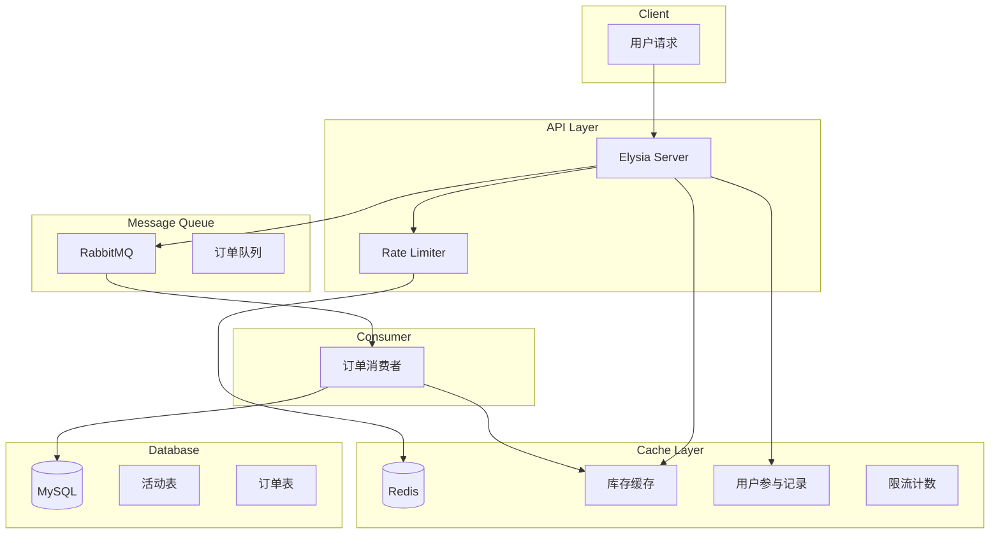

# Design Document: Flash Sale System

## Overview

高并发秒杀系统基于 Elysia + Redis + RabbitMQ + MySQL 构建，采用以下核心策略：
- **Redis 预扣库存**：使用 Lua 脚本原子性扣减，避免超卖
- **RabbitMQ 异步下单**：削峰填谷，提高系统吞吐量
- **MySQL 持久化**：保证订单数据可靠存储
- **限流防护**：保护系统免受恶意请求

## Architecture



## Components and Interfaces

### 1. API Routes

```typescript
// 秒杀活动管理
POST   /api/activities          // 创建活动
GET    /api/activities/:id      // 查询活动状态
PUT    /api/activities/:id      // 更新活动

// 秒杀接口
POST   /api/seckill/:activityId // 参与秒杀
GET    /api/orders/:orderId     // 查询订单状态
GET    /api/orders/user/:userId // 用户订单列表
```

### 2. Services

```typescript
// ActivityService - 活动管理
interface ActivityService {
  create(data: CreateActivityDto): Promise<Activity>
  getById(id: string): Promise<Activity | null>
  getStatus(id: string): Promise<ActivityStatus>
  warmupStock(activityId: string): Promise<void>
}

// SeckillService - 秒杀核心逻辑
interface SeckillService {
  execute(userId: string, activityId: string): Promise<SeckillResult>
  checkUserParticipation(userId: string, activityId: string): Promise<boolean>
}

// StockService - 库存管理
interface StockService {
  deduct(activityId: string, quantity: number): Promise<boolean>
  rollback(activityId: string, quantity: number): Promise<void>
  getStock(activityId: string): Promise<number>
}

// OrderService - 订单管理
interface OrderService {
  create(data: CreateOrderDto): Promise<Order>
  getById(orderId: string): Promise<Order | null>
  updateStatus(orderId: string, status: OrderStatus): Promise<void>
}

// QueueService - 消息队列
interface QueueService {
  publishOrder(order: OrderMessage): Promise<void>
  consumeOrders(handler: OrderHandler): Promise<void>
}
```

### 3. Redis Lua Scripts

```lua
-- 库存扣减脚本 (原子操作)
local stock = tonumber(redis.call('GET', KEYS[1]))
if stock and stock > 0 then
    redis.call('DECR', KEYS[1])
    return 1
end
return 0

-- 用户参与检查+标记脚本
local participated = redis.call('SISMEMBER', KEYS[1], ARGV[1])
if participated == 1 then
    return 0
end
redis.call('SADD', KEYS[1], ARGV[1])
return 1
```

## Data Models

### MySQL Tables (Prisma Schema)

```prisma
model Activity {
  id          String   @id @default(uuid())
  name        String
  productName String
  price       Decimal  @db.Decimal(10, 2)
  stock       Int
  startTime   DateTime
  endTime     DateTime
  status      ActivityStatus @default(PENDING)
  createdAt   DateTime @default(now())
  updatedAt   DateTime @updatedAt
  orders      Order[]
  
  @@map("activities")
}

model Order {
  id          String      @id @default(uuid())
  activityId  String
  userId      String
  status      OrderStatus @default(PENDING)
  createdAt   DateTime    @default(now())
  updatedAt   DateTime    @updatedAt
  activity    Activity    @relation(fields: [activityId], references: [id])
  
  @@unique([activityId, userId])
  @@map("orders")
}

enum ActivityStatus {
  PENDING
  ACTIVE
  ENDED
}

enum OrderStatus {
  PENDING
  PROCESSING
  COMPLETED
  FAILED
}
```

### Redis Data Structures

| Key Pattern | Type | Description |
|-------------|------|-------------|
| `stock:{activityId}` | String | 活动库存数量 |
| `participated:{activityId}` | Set | 已参与用户ID集合 |
| `rate:{userId}` | String | 用户请求计数 (TTL) |

### RabbitMQ Message Format

```typescript
interface OrderMessage {
  orderId: string
  activityId: string
  userId: string
  timestamp: number
}
```

## Correctness Properties

*A property is a characteristic or behavior that should hold true across all valid executions of a system-essentially, a formal statement about what the system should do. Properties serve as the bridge between human-readable specifications and machine-verifiable correctness guarantees.*

### Property 1: 活动创建数据一致性
*For any* 秒杀活动创建请求，创建成功后数据库中的库存数量与 Redis 缓存中的库存数量应该相等。
**Validates: Requirements 1.1, 2.1**

### Property 2: 库存扣减正确性 (不超卖)
*For any* 初始库存为 N 的活动，无论并发请求数量多少，成功扣减的总次数不应超过 N。
**Validates: Requirements 2.2, 2.3, 2.4**

### Property 3: 用户参与唯一性
*For any* 用户和活动组合，该用户只能成功参与该活动一次，重复请求应被拒绝。
**Validates: Requirements 4.2**

### Property 4: 订单消息 Round-Trip
*For any* 有效的订单消息对象，序列化为 JSON 后再反序列化应得到等价的对象。
**Validates: Requirements 3.5, 3.6**

### Property 5: 库存回滚一致性
*For any* 订单处理失败的情况，Redis 库存应该回滚，回滚后库存 = 回滚前库存 + 1。
**Validates: Requirements 2.5, 3.4**

### Property 6: 活动状态时间约束
*For any* 秒杀活动，当前时间在 startTime 之前状态应为 PENDING，在 startTime 和 endTime 之间应为 ACTIVE，在 endTime 之后应为 ENDED。
**Validates: Requirements 1.2, 1.3**

### Property 7: 限流阈值有效性
*For any* 用户在限流时间窗口内，请求次数超过阈值后的请求应被拒绝。
**Validates: Requirements 5.1**

### Property 8: 订单状态查询完整性
*For any* 存在的订单，查询结果应包含订单状态字段。
**Validates: Requirements 6.1**

## Error Handling

| 错误场景 | 错误码 | 处理方式 |
|---------|--------|---------|
| 活动不存在 | 404 | 返回活动未找到 |
| 活动未开始 | 400 | 返回活动未开始 |
| 活动已结束 | 400 | 返回活动已结束 |
| 库存不足 | 400 | 返回库存不足 |
| 重复参与 | 400 | 返回已参与过 |
| 请求限流 | 429 | 返回请求过于频繁 |
| Redis 连接失败 | 503 | 降级处理 |
| RabbitMQ 连接失败 | 503 | 重试或降级 |

## Testing Strategy

### Unit Tests
- 活动服务：创建、查询、状态计算
- 库存服务：扣减、回滚、查询
- 订单服务：创建、状态更新
- 限流器：计数、阈值判断

### Property-Based Tests
使用 `fast-check` 库进行属性测试：

1. **库存扣减不超卖测试**：生成随机库存和并发请求数，验证成功数 ≤ 库存
2. **用户唯一参与测试**：生成随机用户和活动，验证重复请求被拒绝
3. **消息序列化 Round-Trip 测试**：生成随机订单消息，验证序列化/反序列化一致性
4. **活动状态时间测试**：生成随机时间点，验证状态计算正确
5. **限流测试**：生成随机请求序列，验证超阈值请求被拒绝

每个属性测试配置运行 100 次迭代。
